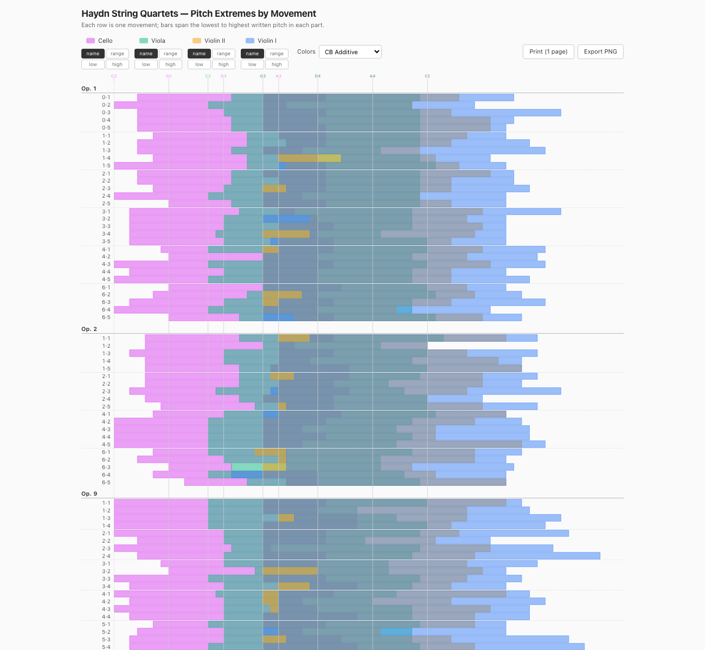

# haydn-lowdn

Interactive visualization of pitch extremes — the **low**est and **high**est notes — across every movement of every Haydn string quartet, for each part (Violin I, Violin II, Viola, Cello).

🎻 **Live:** https://jsundram.github.io/haydn-lowdn/



## What it shows

Each row is one movement. The four overlapping translucent bars in that row mark the lowest-to-highest written pitch for each instrument in that movement. Vertical light-gray rules behind everything mark the open-string positions (cello C2/G2/D3/A3, viola C3/G3/D4/A4, violin G3/D4/A4/E5), with colored labels above scaled by which instruments share that pitch.

### Interactions

- **Hover/tap a row** — the part nearest the cursor pops to full opacity and its endpoints are labeled with the pitch names. Click to pin; click elsewhere to release.
- **Legend buttons** — toggle each part on/off (multi-select). When only one part is left visible, its endpoint labels show across every row.
- **Sort buttons** under each legend item — `name` (default opus order), `low`, `high`, `range` for that instrument.
- **Colors dropdown** — four palettes: MusicLog (the original), CB Additive (default, color-blind-friendly), Wood & Strings, Tol.
- **Print (1 page)** — a 3-column letter-portrait PDF that fits the whole catalog on one page.
- **Export PNG** — a single tall PNG (the "long screenshot" you'd want for sharing).

### Movement labels

In default (name) sort, labels read `quartet · movement` grouped under each opus heading — e.g. `3·1` is No. 3, mvt 1. The leading `0` on Op. 1 is from the source data; the quartet sometimes called Op. 1 No. 5 is excluded because it isn't actually by Haydn. In non-name sorts, labels are `op-no-mv` (e.g. `9-1-1`, or `42-1` for the single-quartet opuses).

Movement labels link out to the corresponding [quartetroulette.com](https://quartetroulette.com/) page.

## Snapshots of all four render targets

| Target | File |
|---|---|
| Desktop | [outputs/desktop.png](outputs/desktop.png) |
| Mobile (iPhone 17 portrait) | [outputs/mobile.png](outputs/mobile.png) |
| Print PDF (3 columns, 1 page) | [outputs/print.pdf](outputs/print.pdf) |
| PNG export (long single column) | [outputs/png_export.png](outputs/png_export.png) |

Regenerate with:

```bash
./snapshot.sh
```

This runs four headless Chrome instances in parallel — one per form factor — into `outputs/`. Useful before pushing any change to make sure all four targets still look right.

## Source

- `index.html` — single self-contained file. The CSV is embedded inline (`<script type="text/plain" id="csv-data">`), so it works equally well from `file://`, GitHub Pages, or any static host.
- `extremes.csv` — source data: one row per movement, columns `<part>-hi` and `<part>-lo`.
- `snapshot.sh` — the regeneration script.
